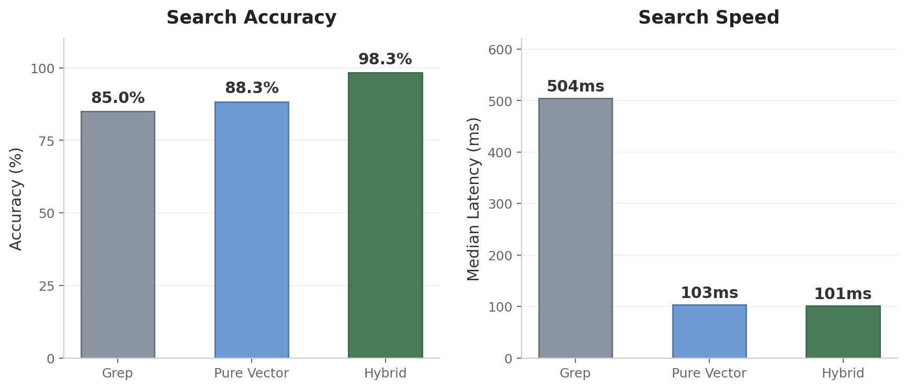

<p align="center">
  
</p>

<h1 align="center">Beacon</h1>

<p align="center">
  <strong>Semantic code search for <a href="https://docs.anthropic.com/en/docs/claude-code">Claude Code</a></strong><br>
  Find code by meaning, not just string matching.
</p>

<p align="center">
  <a href="#quick-start">Quick Start</a> · <a href="#commands">Commands</a> · <a href="#embedding-providers">Providers</a> · <a href="#configuration">Config</a>
</p>

---

<p align="center">
  
</p>

<p align="center">
  <strong>98.3% accuracy · 5x faster than grep · 20-query benchmark on a real codebase</strong>
</p>

---

## Quick Start

```bash
# 1. Install the plugin
claude plugin add sagarmk/Claude-Code-Beacon-Plugin

# 2. Pull the default embedding model (local, free)
ollama pull nomic-embed-text

# 3. Done — Beacon indexes automatically on your next session
```

## Why Beacon?

**Understands your questions.** Ask "where is the auth flow?" and get `lib/auth.ts` — not every file containing the word "auth". Hybrid search combines vector similarity, BM25 keyword matching, and identifier boosting.

**Stays in sync automatically.** Hooks handle everything: full index on first run, incremental re-embedding on edits, garbage collection on deletes. No manual maintenance.

**Works with any embedding provider.** Ollama runs locally for free. Or plug in OpenAI, Voyage AI, LiteLLM, or any OpenAI-compatible API.

**Gives Claude better context.** 9 slash commands, a code-explorer agent, and a grep-nudge hook that steers Claude toward semantic search when grep would miss the mark.

## Embedding Providers

Beacon defaults to **Ollama** (local, free, no API key needed). For cloud providers, create `.claude/beacon.json` in your repo:

<details>
<summary><strong>OpenAI</strong></summary>

```bash
export OPENAI_API_KEY="sk-..."
```

```json
{
  "embedding": {
    "api_base": "https://api.openai.com/v1",
    "model": "text-embedding-3-small",
    "api_key_env": "OPENAI_API_KEY",
    "dimensions": 1536,
    "batch_size": 100,
    "query_prefix": ""
  }
}
```

</details>

<details>
<summary><strong>Voyage AI</strong></summary>

```bash
export VOYAGE_API_KEY="pa-..."
```

```json
{
  "embedding": {
    "api_base": "https://api.voyageai.com/v1",
    "model": "voyage-code-3",
    "api_key_env": "VOYAGE_API_KEY",
    "dimensions": 1024,
    "batch_size": 50,
    "query_prefix": ""
  }
}
```

</details>

<details>
<summary><strong>LiteLLM proxy</strong> (Vertex AI, Bedrock, Azure, etc.)</summary>

```bash
pip install litellm
litellm --model vertex_ai/text-embedding-004 --port 4000
```

```json
{
  "embedding": {
    "api_base": "http://localhost:4000/v1",
    "model": "vertex_ai/text-embedding-004",
    "api_key_env": "LITELLM_API_KEY",
    "dimensions": 1024,
    "batch_size": 50,
    "query_prefix": ""
  }
}
```

</details>

<details>
<summary><strong>Custom endpoint</strong></summary>

Any server implementing the OpenAI `/v1/embeddings` API will work. Set `api_base`, `model`, `dimensions`, and optionally `api_key_env` in `.claude/beacon.json`.

</details>

## Commands

| Command | Description |
|---------|-------------|
| `/search-code` | Hybrid code search — semantic + keyword + BM25 matching |
| `/index` | Visual overview of Beacon index — files, chunks, coverage, provider |
| `/index-status` | Show index health — file count, chunk count, last sync |
| `/reindex` | Force a full re-index (escape hatch if index gets corrupted) |
| `/run-indexer` | Manually trigger indexing (useful when auto-index is off) |
| `/terminate-indexer` | Kill a running sync process and clean up state |
| `/config` | View and modify Beacon configuration |
| `/blacklist` | Prevent indexing of specific directories |
| `/whitelist` | Allow indexing in directories that would otherwise be blacklisted |

Beacon also provides a **code-explorer** agent for deep codebase exploration and a **semantic-code-search** skill that Claude can invoke automatically.

## How It Works

Beacon uses Claude Code [hooks](https://docs.anthropic.com/en/docs/claude-code/hooks) to stay in sync with your codebase:

| Hook | Trigger | What it does |
|------|---------|-------------|
| **SessionStart** | Every session | Full index on first run, diff-based catch-up on subsequent runs |
| **PostToolUse** | `Write`, `Edit`, `MultiEdit` | Re-embeds the changed file |
| **PostToolUse** | `Bash` | Garbage collects embeddings for deleted files |
| **PreCompact** | Before context compaction | Injects index status so search capability survives compaction |
| **PreToolUse** | `Grep` | Nudges Claude toward Beacon when grep is used for semantic-style queries |

<details>
<summary><strong>Configuration</strong></summary>

Default configuration (`config/beacon.default.json`):

```json
{
  "embedding": {
    "api_base": "http://localhost:11434/v1",
    "model": "nomic-embed-text",
    "api_key_env": "",
    "dimensions": 768,
    "batch_size": 10,
    "query_prefix": "search_query: "
  },
  "chunking": {
    "strategy": "hybrid",
    "max_tokens": 512,
    "overlap_tokens": 50
  },
  "indexing": {
    "include": ["**/*.ts", "**/*.tsx", "**/*.js", "..."],
    "exclude": ["node_modules/**", "dist/**", "..."],
    "max_file_size_kb": 500,
    "auto_index": true,
    "max_files": 10000
  },
  "search": {
    "top_k": 10,
    "similarity_threshold": 0.35,
    "hybrid": {
      "enabled": true,
      "weight_vector": 0.4,
      "weight_bm25": 0.3,
      "weight_rrf": 0.3,
      "doc_penalty": 0.5,
      "identifier_boost": 1.5,
      "debug": false
    }
  },
  "storage": {
    "path": ".claude/.beacon"
  }
}
```

| Option | Default | Description |
|--------|---------|-------------|
| `embedding.api_base` | `http://localhost:11434/v1` | Embedding API endpoint |
| `embedding.model` | `nomic-embed-text` | Embedding model name |
| `embedding.dimensions` | `768` | Vector dimensions (must match model) |
| `embedding.query_prefix` | `search_query: ` | Prefix prepended to search queries |
| `indexing.include` | Common code patterns | Glob patterns for files to index |
| `indexing.exclude` | `node_modules`, `dist`, etc. | Glob patterns to skip |
| `indexing.max_file_size_kb` | `500` | Skip files larger than this |
| `indexing.auto_index` | `true` | Auto-index on session start |
| `search.top_k` | `10` | Max results per query |
| `search.similarity_threshold` | `0.35` | Minimum similarity score |
| `search.hybrid.enabled` | `true` | Enable hybrid search (set `false` for pure vector) |

</details>

## Per-repo Overrides

Create `.claude/beacon.json` in any repo to override defaults. Values are deep-merged with the default config:

```json
{
  "embedding": {
    "api_base": "https://api.openai.com/v1",
    "model": "text-embedding-3-small",
    "api_key_env": "OPENAI_API_KEY",
    "dimensions": 1536
  },
  "indexing": {
    "include": ["**/*.py"],
    "max_files": 5000
  }
}
```

## Storage

Beacon stores its SQLite database at `.claude/.beacon/embeddings.db` (configurable via `storage.path`). This file is auto-generated and safe to delete — run `/reindex` to rebuild.

The database uses [sqlite-vec](https://github.com/asg017/sqlite-vec) for vector search and FTS5 for keyword matching.

## License

[MIT](LICENSE)
